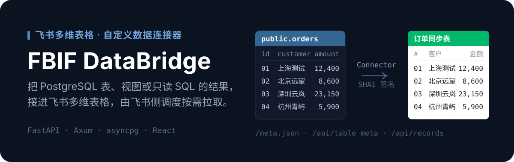

<p align="center">
  
</p>

<p align="center">
  
  
  
  
  
</p>

# FBIF DataBridge · 数据桥

把 PostgreSQL 表、视图或只读 SQL 查询接入飞书多维表格的**自定义数据连接器**。后端实现飞书数据同步 Connector 协议，前端是跑在飞书 iframe 里的连接配置页。

数据方向是单向的：PostgreSQL → 多维表格。飞书侧负责调度，本服务只响应协议请求。

> **关于「当前生产后端」**：仓库能证明的是，`main` 的自动工作流发布 Python/FastAPI，Rust/Axum 由手动灰度工作流发布到独立端口。`WORKLOG.md` 记录过 2026-07-01 的人工 Rust 切流，但**仓库无法单独证明任一外部环境此刻的反向代理目标**。部署前必须先核验线上状态，不能仅凭历史记录判断。

## 产品边界

| 项目 | 当前范围 |
| --- | --- |
| 使用者 | 需要把 PostgreSQL 数据同步到飞书多维表格的团队 |
| 数据方向 | PostgreSQL → 飞书多维表格，拉取式同步 |
| 数据源 | 仅 PostgreSQL / RDS PostgreSQL |
| 数据集 | 表、视图或只读自定义 SQL 的结果 |
| 配置方式 | 飞书 iframe 内填写连接、选择单表或输入 SQL |
| 调度归属 | 飞书侧负责调度；本服务只响应协议请求 |
| 非目标 | 双向同步、CDC、数据库管理、通用 ETL、多租户 SaaS |

MySQL、MongoDB、REST API 等仅是待评估方向，**不是现有能力**。

## 能做什么

- 列出数据库、Schema、表、视图和字段，并测试连接。
- 整表 / 视图同步与自定义 SQL 结果同步。
- 字段筛选、重命名、主键识别、类型映射和分页 token。
- `/meta.json` 动态追加时间戳，避免飞书缓存旧配置页 URL。
- Python 后端提供连接池缓存、超时、统一协议错误与 pytest 覆盖。
- Rust 后端额外提供 `/ready`、`/metrics`、严格验签路径、只读事务和更细的资源边界。

### 已实现的硬限制

| 限制 | 当前值 / 行为 |
| --- | --- |
| 单次同步总行数 | 默认最多 `50000`，由 `MAX_ROW_LIMIT` 调整 |
| 字段数 | 最多 `299` |
| `/api/table_meta` 预算 | 10 秒 |
| `/api/records` 预算 | 20 秒 |
| 未识别的 PostgreSQL 类型 | 退化为文本 |
| 数组、JSON、`time` 等 | 文本或序列化字符串 |
| 写入数据库 | 不需要；**数据库只读账号是最终权限护栏** |

## 架构与协议

```text
飞书多维表格
  ├─ GET  /meta.json
  ├─ POST /api/table_meta ─┐
  └─ POST /api/records    ─┼─ Connector 协议签名
                            ▼
                     Connector backend
                      ├─ backend/    Python + FastAPI
                      └─ backend-rs/ Rust + Axum
                            │
                            ▼
                       PostgreSQL

配置 iframe ─► frontend/ React + Vite ─► /api/helper/*
```

### 协议不变量

- 签名算法：`SHA1(timestamp + nonce + secretKey + rawBody).hex()`；**必须使用原始请求体**。
- Connector 业务错误保持 HTTP 200，并在响应体返回飞书错误码。
- `dataSourceConfigUiUri` 必须带动态查询参数，避免飞书缓存旧配置页。
- 一个连接器配置只对应一张同步表；前端使用单表选择。
- 自定义 SQL 只能读取数据，数据库只读角色是最终安全边界。

### 核心端点

| 方法 | 路径 | 用途 |
| --- | --- | --- |
| `GET` | `/health` | 存活检查 |
| `GET` | `/meta.json` | Connector 元数据与动态配置页 URL |
| `POST` | `/api/table_meta` | 返回表结构与唯一主字段 |
| `POST` | `/api/records` | 分页返回记录 |
| `POST` | `/api/helper/test_connection` | 配置页测试 PostgreSQL 连接 |
| `POST` | `/api/helper/databases`、`schemas`、`tables`、`columns` | 配置页元数据发现 |
| `POST` | `/api/helper/preview_sql` | 预览自定义 SQL |
| `GET` | `/ready`、`/metrics` | 仅 Rust 后端提供 |

## 两套后端实现

| 维度 | Python `backend/` | Rust `backend-rs/` |
| --- | --- | --- |
| 数据库客户端 | asyncpg | tokio-postgres + deadpool |
| Connector 端点 | 已实现 | 已实现 |
| helper 端点 | 已实现 | 已实现 |
| 就绪 / 指标 | `/health` | `/health`、`/ready`、`/metrics` |
| 默认 Compose | 是 | 否 |
| 仓库发布方式 | `main` push 自动发布 | `workflow_dispatch` 手动灰度 |
| 角色 | 可复现的自动发布基线 | 已实现的替代后端，**是否承载流量需查外部环境** |

## 快速开始

### Python 后端

要求 Python 3.11+ 和 `uv`：

```bash
cd backend
cp .env.example .env
uv sync --extra dev
uv run uvicorn src.main:app --reload --host 0.0.0.0 --port 8000
```

### 前端配置页

```bash
cd frontend
npm ci
VITE_API_BASE_URL=http://localhost:8000 npm run dev
```

同域部署时改用 `VITE_API_BASE_URL='' npm run build`。

<details>
<summary><b>Rust 后端与 Docker Compose</b></summary>

```bash
cd backend-rs
cargo test
cargo build --release
BIND_ADDR=127.0.0.1:18082 \
SECRET_KEY='replace-with-a-strong-secret' \
HELPER_API_KEY='replace-with-an-independent-key' \
./target/release/fbif-databridge
```

Rust 的配置、兼容差异和切换检查见 [`backend-rs/README.md`](backend-rs/README.md)。

```bash
cp backend/.env.example backend/.env.production
docker compose up -d --build
```

当前 Compose 只构建 Python 后端，并依赖外部 Docker network `postgres_default`。目标 PostgreSQL 不在该网络时，应先修改网络配置；**不要为了省事把数据库直接暴露到公网**。

</details>

## 配置

### 后端

| 变量 | 说明 |
| --- | --- |
| `SECRET_KEY` | Connector 签名密钥；默认值只允许本地开发 |
| `FRONTEND_URL` | 写入 `meta.json` 的配置页地址 |
| `MAX_ROW_LIMIT` | 单次同步总行数上限 |
| `PG_CONNECT_TIMEOUT` / `PG_QUERY_TIMEOUT` | PostgreSQL 连接和查询超时 |
| `POOL_MAX_SIZE` / `POOL_IDLE_TIMEOUT` / `POOL_MAX_POOLS` | 连接池边界 |
| `HELPER_API_KEY` | 配置页 helper API key |

Python 还读取 `BACKEND_URL`、`CORS_ORIGINS`；Rust 还读取 `BIND_ADDR`、`RUST_LOG`、`ALLOW_UNSIGNED`。

### 前端构建

| 变量 | 说明 |
| --- | --- |
| `VITE_API_BASE_URL` | 后端基地址；同域部署使用空字符串 |
| `VITE_HELPER_API_KEY` | helper key，必须与后端一致 |
| `VITE_DEFAULT_PORT` / `VITE_DEFAULT_SCHEMA` | 默认 PostgreSQL 端口和 Schema |
| `VITE_MOCK` | 仅开发模式 UI mock |

> 所有 `VITE_*` 值都会进入浏览器产物。`VITE_HELPER_API_KEY` 只能视为低强度调用门槛，**不能替代**网络限制、速率限制和数据库只读权限。

## 验证

```bash
cd backend
uv run pytest
uv run ruff check src tests
uv run mypy src

cd ../frontend
npm run build

cd ../backend-rs
cargo test
```

2026-07-17 的本地工作树基线：Python 103 项测试通过，Ruff 与 mypy 通过；Rust 51 项测试通过；前端生产构建通过，并有既有的 Vite 大 chunk 警告。项目内虚拟环境的命令脚本仍引用旧目录时，可用 `./.venv/bin/python -m pytest` 等模块方式运行。

## 部署与安全

- `.github/workflows/deploy.yml`：`main` push 自动构建前端、同步 Python 后端并重建 Python 容器；**不运行后端测试或静态检查**。
- `.github/workflows/deploy-rust.yml`：手动构建 Rust 镜像并启动灰度容器；工作流显式设置 `ALLOW_UNSIGNED=true`，**不能直接视作安全的正式配置**。
- `deploy.sh` 会在服务器仓库执行硬重置，只应在确认远端工作树可丢弃时使用。
- 发布前至少核验：线上 Caddy 目标、容器端口、签名正反例、只读数据库权限、`table_meta` / `records` 跨实现语义、真实飞书同步。
- 生产必须配置强随机 `SECRET_KEY`；最终目标是关闭 `ALLOW_UNSIGNED`。
- 数据库凭据、TLS 私钥和真实 helper key 只通过 secret 注入，禁止写入仓库、日志或文档示例。
- `/metrics` 只应暴露在受控监控网络中。

## 已知限制与开放事项

- 前端当前没有独立的组件测试脚本，只有 TypeScript / Vite 构建校验。
- 当前发布配置绑定既有 ECS、Caddy、域名和目录，不是可直接交付第三方服务器的一键部署包。
- 外部环境的 Rust 切流、真实飞书全链路验证、签名收口和旧 Python 清理仍需核验或决策。

只保留真实未完成事项的清单见 [`WORKLOG.md`](WORKLOG.md)。

## 项目结构

```text
.
├── frontend/              # React 配置 iframe
├── backend/               # 当前自动部署的 Python/FastAPI 实现
├── backend-rs/            # Rust/Axum 灰度实现
├── docs/
│   ├── 多维表格「数据同步插件」开发者指南/
│   └── designs/           # 平台、前端与 Rust 重写设计
├── .github/workflows/     # Python 自动部署与 Rust 手动灰度
├── docker-compose.yml     # Python 后端 Compose
└── deploy.sh              # 现有部署脚本
```

## 文档索引

| 文档 | 定位 |
|---|---|
| [`CLAUDE.md`](CLAUDE.md) | 项目长期记忆、工程约束和事实优先级 |
| [`backend-rs/README.md`](backend-rs/README.md) | Rust 构建、配置和切换 runbook |
| [`docs/多维表格「数据同步插件」开发者指南/多维表格「数据同步插件」开发者指南.md`](docs/%E5%A4%9A%E7%BB%B4%E8%A1%A8%E6%A0%BC%E3%80%8C%E6%95%B0%E6%8D%AE%E5%90%8C%E6%AD%A5%E6%8F%92%E4%BB%B6%E3%80%8D%E5%BC%80%E5%8F%91%E8%80%85%E6%8C%87%E5%8D%97/%E5%A4%9A%E7%BB%B4%E8%A1%A8%E6%A0%BC%E3%80%8C%E6%95%B0%E6%8D%AE%E5%90%8C%E6%AD%A5%E6%8F%92%E4%BB%B6%E3%80%8D%E5%BC%80%E5%8F%91%E8%80%85%E6%8C%87%E5%8D%97.md) | 飞书 Connector 协议基线 |
| [`docs/designs/rust-backend-rewrite.md`](docs/designs/rust-backend-rewrite.md) | Rust 设计、兼容性与灰度验收标准 |
| [`docs/designs/data-connector-platform.md`](docs/designs/data-connector-platform.md) | 多数据源平台方向；未落地部分不代表当前能力 |
| [`docs/designs/frontend-refactor-brief.md`](docs/designs/frontend-refactor-brief.md) | 前端重构语境 |
| [`CHANGELOG.md`](CHANGELOG.md) | 已记录的版本变化 |
| [`WORKLOG.md`](WORKLOG.md) | 阶段性决策与验证记录；其中未来计划不应作为线上状态依据 |
