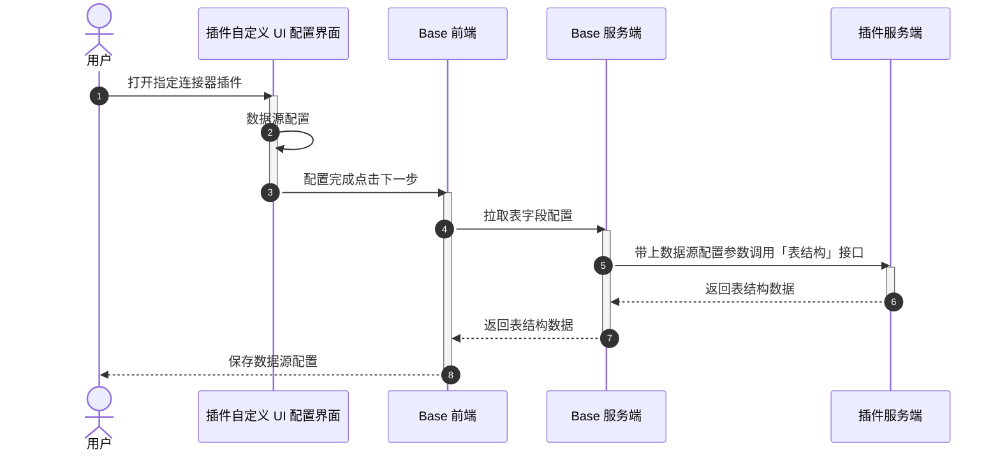
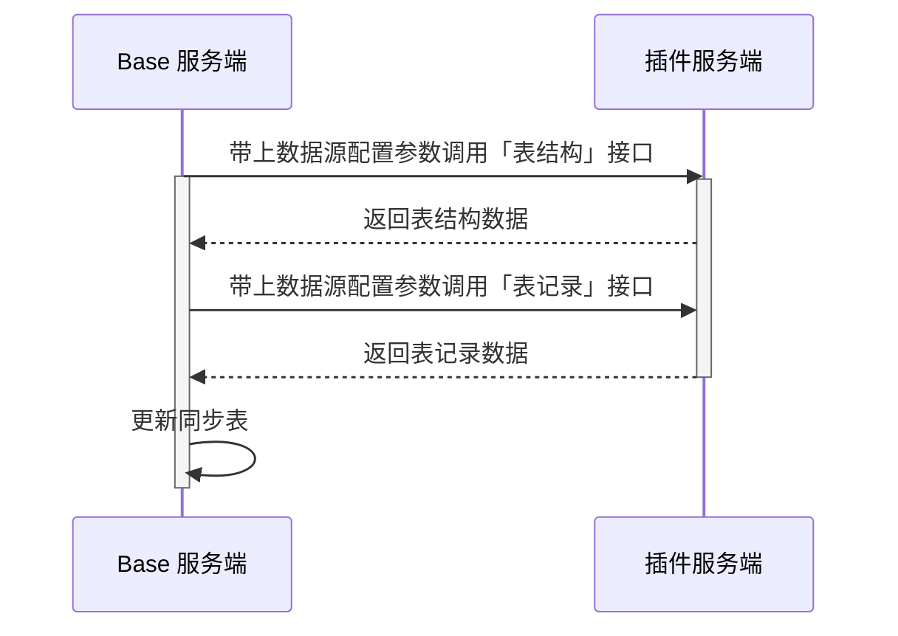
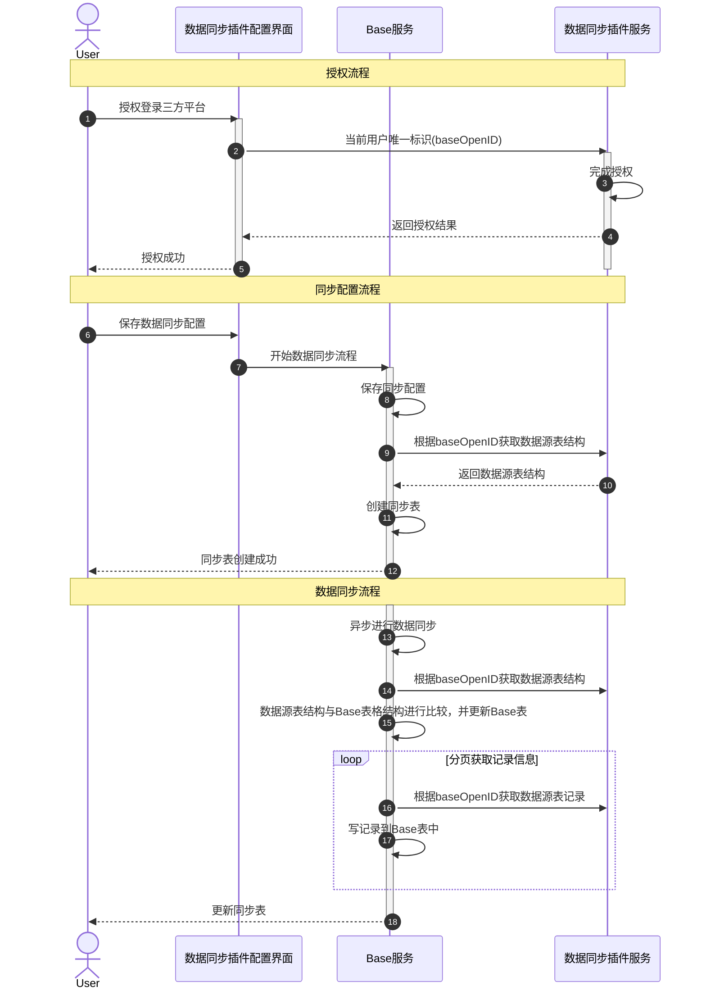

# 多维表格「数据同步插件」开发者指南

# 数据同步插件概述

## 数据同步插件是什么？

**数据同步插件**支持用户将外部系统数据自动或手动同步到多维表格，自动同步支持周期同步或实时同步（如飞书审批同步到多维表格、MySQL同步到多维表格）。开发者开发完成数据同步插件后，可以共享发布到数据源面板，发布给所有多维表格用户，或者仅发布给企业内部用户使用。

本文供开发者参考，如果你有数据同步需求，但暂无编程经验，可寻找公司内工程师的帮助，或提交[需求](https://bytedance.larkoffice.com/share/base/form/shrcnKhFtxdtBSiIUkIAp43iUug)招募其他开发者支持。


**常见的数据同步场景：**

- 企业内部自定义业务系统同步到多维表格

- CRM/ERP等企业服务系统同步到多维表格

- 表单/问卷/在线表格等数据系统同步到多维表格

- 小红书/抖音等电商系统同步到多维表格

## 数据同步插件如何使用？

以 「Jira Cloud 同步到多维表格」为例，来为大家介绍数据同步插件在用户侧的表现

|**步骤**|**示例**|
|---|---|
|**1**** 获取用户授权允许页面\&三方授权页面**<br>|<br><br><br>|
|**2 授权完成后，选择需要同步的数据源**<br>> 示例中 jira 是选择项目清单 <br>> <br>> <br>||
|**3 选择项目后，支持用户选择同步的数据字段范围及同步周期**<br>||
|**4 点击「保存并同步」后，会自动创建一张表，并且把数据同步到表中。表中的数据无法进行编辑，只有外部系统中的数据发生了变更，并触发同步后才会更新**<br>||
|**5 连接器提供手动同步，以及自动同步的能力。会将外部系统的字段变更以及数据变更同步到 Base 表中**<br>||
|**6 提供连接器配置修改及移除同步，移除同步后表格会变为一张普通的多维表，支持编辑管理数据**<br>||

# 如何开发数据同步插件

## **快速开始**

这里提供了前后端分离的代码模版，你可以 fork 模版进行快速上手：

- 前端配置界面模版：https://replit\.com/@lark\-base/data\-sync\-fe\-demo

- 后端接口模板 \(Node\.js\)：https://replit\.com/@lark\-base/data\-sync\-be\-demo

如果希望深入了解数据连接器的工作原理，可以看[4\.2 数据连接器工作原理](https://feishu.feishu.cn/docx/GwBXdq7cmoZahfx8faQchcS2nXf#HHpxdE0WwoEnVBx08C1cSTAgnFh)

如果无法访问replit，可以查看这些代码包：

[data\-sync\-fe\-demo\.zip](图片和附件/data-sync-fe-demo.zip)

[data\-sync\-be\-demo\.zip](图片和附件/data-sync-be-demo.zip)

可直接访问上述链接在 replit 上进行 fork，方便修改代码调试：


### 前端配置页面开发

#### **UI 开发**

UI 配置 React 代码示例实现可参考  https://replit\.com/@lark\-base/data\-sync\-fe\-demo\#src/App\.tsx

同步配置界面用于承载待同步数据的相关配置，你需要基于自己的业务场景定制不同的配置，以 Jira 数据同步插件为例（可根据不同的场景增加或减少配置项）：

- 配置项一：授权的 Jira 账号

- 配置项二：当前所选授权账号下的项目


上述 React Demo 示例配置界面运行的结果如下：


#### **前端 API **

为了辅助完成「授权」和「数据配置」界面的开发，我们提供了「前端 SDK」 用于一些必要信息的查询和写入。

1. 通过以下命令在你的前端项目中安装前端 SDK：

```Shell
npm i @lark-base-open/connector-api@latest
```

2. 前端 SDK 拥有统一入口 `bitable`，通过以下方式进行引入：

```TypeScript
import { bitable } from '@lark-base-open/connector-api';
```

**同步配置接口**

- **getConfig**

获取指定同步表已保存的配置，在修改同步表配置时，可使用该 API 拿到所需的配置。

```JavaScript
bitable.getConfig(): Promise<Record<string, any>>;
```

- **saveConfigAndGoNext**

保存当前数据同步配置，配置信息的结构由开发者自定义，格式为 key\-value 的形式。通常该 API 需要在用户配置完成后调用，调用该 API 后会关闭当前插件窗口并进入同步字段配置。

```JavaScript
bitable.saveConfigAndGoNext(configData: Record<string, any>): Promise<void>;
```

**环境信息接口**

- **getBaseUserId**

获取当前用户的唯一标识，该用户标识在不同插件点位（侧边栏、连接器、视图等）中均唯一，通常插件需要将该用户标识与三方授权结果进行绑定。

该接口返回的用户 ID 与飞书开放平台的 OpenUserId 并不通用，请勿将其作为全平台的唯一 id。

```JavaScript
bitable.getBaseUserId(): Promise<string>;
```

- **getTenantKey**

获取当前用户的租户唯一标识（当前仅支持 base 中使用该API，不支持在 wiki 中使用）

```JavaScript
bitable.getTenantKey(): Promise<string>;
```

#### **运行调试**

开发完成后，你需要将前端配置页面部署至一个公网可访问的 URL，以[上述前端 demo](https://replit.com/@lark-base/data-sync-fe-demo) 为例：

- 点击 Run


- 运行完成后点击 Webview 中的 `New tab`


- 复制该 Tab 的 URL（需要去掉url最后的/），该 URL 会在后续调试流程中用到


该运行地址需要填入后端代码的 [插件配置文件 meta\.json](https://bytedance.larkoffice.com/wiki/CD4uwG7ptiqyx6koqpWcVcxvnxe?renamingWikiNode=false#JNXAdABjToI6TdxcF8RcIadLnyd) 中的 `dataSourceConfigUiUri`（含义是前端配置界面的地址，也可以和运行地址不一样） 字段。

### 后端接口开发

后端 Node\.js 模板：https://replit\.com/@lark\-base/data\-sync\-be\-demo

#### **插件配置接口\(meta\.json\)**

每个连接器项目都需要在服务访问地址根目录下提供一个静态资源 meta\.json 访问路径，用来返回插件的元信息，这些元信息告知 Base 以下信息：

- **插件前端的加载地址、UI配置信息**

- **插件服务端的表结构、数据获取接口地址**

> 内容示例可参考 https://replit\.com/@lark\-base/data\-sync\-be\-demo\#public/meta\.json
> 
> 

**接口协议**

|**说明**|该接口主要返回插件的一些元信息，例如前端服务地址、UI配置、后端接口的相对路径等|
|---|---|
|**方法**|`GET`|
|**URI**|http://应用服务地址/meta\.json <br>如应用服务地址是： https://integration\-test\-demo\.feishu\-base\.repl\.co （填入到运行地址的时候，注意不能有/后缀）<br>则请求meta\.json为： https://integration\-test\-demo\.feishu\-base\.repl\.co/meta\.json|
|**超时限制**|10 秒|

`meta.json` 的结构如下，请参考下面的格式返回

```JSON
{
  "schemaVersion": 1,// 不能缺少
  "version": "1.0.0",// 不能缺少
  "type": "data_connector",// 固定值，不能缺少
  "extraData": {
    "disabledPeriodicSync": false,
    
    // 此属性返回的不能是http，必须是https，否则会被浏览器安全策略拦截
    "dataSourceConfigUiUri": "https://ext.baseopendev.com/ext/data-sync-fe-demo/c70fa2864a002386423f26411f21a3c674bc2f9c/index.html", // 前端配置界面 URL
    "initHeight": 300, // 初始化的配置窗口内容高度，最小226，最大606
    "initWidth": 520, // 初始化的配置窗口内容宽度，最小420，最大840
  },
  "protocol": {
    "type": "http",// 固定值，不能缺少
    "httpProtocol": {
      "uris": [
          {
            "type": "tableMeta",
            "uri": "/api/table_meta" // 表结构接口路径
          },
          {
            "type": "records",
            "uri": "/api/records" // 表记录接口路径
          }
      ]
    }
  }
}
```

**特别说明**：

- `dataSourceConfigUiUri` 指的是数据同步插件 UI 界面的访问地址。以示例代码为例，即 Replit 前端项目启动后的运行地址

- 对于`httpProtocol`中的`uris`列表会进行参数校验，校验`uri`值不为空


最终访问结果如下图：


#### 表结构接口

表结构接口 Node\.js 版本的实现可参考 https://replit\.com/@lark\-base/data\-sync\-be\-demo\#table\_meta\.js

**接口协议**

**基本信息**

|**说明**|该接口返回 数据源的表结构，指明数据源的数据有哪些字段，每个字段是什么类型|
|---|---|
|**方法**|`POST`|
|**URI**|与 meta\.json 中的 tableMetaURI 一致|
|**超时限制**|10 秒|
|demo地址|https://replit\.com/@Feishu\-Base/integration\-test\-demo\#pages/api/table\_meta\.ts|

**请求头**

|**Key**|**value 描述**|
|---|---|
|**X\-Base\-Request\-Timestamp**<br>|签名信息，详看下文「**请求签名**」逻辑<br><br>|
|**X\-Base\-Request\-Nonce**|签名信息，详看下文「**请求签名**」逻辑|
|**Content\-Type**|固定值："application/json; charset=utf\-8"|

**请求体**

|**参数名**|**类型**|**描述**|
|---|---|---|
|params|string|- 查询参数，值为 json 字符串，结构：<br>\{<br>datasourceConfig: string // 用户在数据源配置页面选择的配置信息，也就是前端调用前端sdk `bitable.saveConfigAndGoNext(configData: Record<string, any>)`保存的信息，值由开发者定义，服务端在请求插件服务接口时透传<br>\}|
|context<br>|string|- 系统参数，值为 json 字符串，结构：<br>\{<br>    bitable: \{<br>        token: string; //  Base token<br>        logID: string; // 请求日志 id<br>    \},<br>    packID: string;<br>    type: string， // 插件类型： script、plugin<br>    tenantKey: string, // 租户标识<br>    userTenantKey: string; // 用户所属租户的租户标识<br>bizInstanceID: string // 插件业务实例ID, 当值为0时，代表在还没有创建的情况下请求 `表结构接口`<br>    scriptArgs: \{<br>        projectURL: string<br>        baseOpenID: string, // 用户身份标识，也就是通过前端sdk bitable\.getUserId\(\)拿到的id<br>\}<br>\}|

**请求体示例**

```JSON
{
  "params":"{\"datasourceConfig\":\"{\"xxx\":\"yyy\"}\"}", 
  "context": "{}"  
}
```


**response body**

|**参数名**|**类型**|是否必填|校验规则|**描述**|
|---|---|---|---|---|
|code|int|是||0 代表成功，非 0 则是异常错误码，规定的错误码场景：<br>1254400: 配置错误，即用户在配置面板选择的值不合法可以返回该错误码<br>1254403：用户访问权限异常<br>1254500：系统异常，插件运行错误<br>1254501：限流异常<br>1254505：付费错误异常<br>具体的错误信息，在msg 字段中返回|
|msg|string |否<br>|**注意：msg 的格式为 json 字符串，里面需要包含 中英文的错误信息，当发生异常时，开发者需要同时返回这两种语言的信息，这样连接器会根据用户的语言环境展示不同的错误信息**<br>参考：<br>```JSON<br>{<br> "zh":"出现异常",<br> "en":"error happend",<br>}<br>```|异常时，填写错误信息，会透传到 Base 表格页面显示<br><br>|
|data|object||||
|\-\- tableName|string|是|1. max: 100 字符<br>2. 不包含特殊符号:`/\?*[]:` \(若包含会自动去除\)|数据源名，会作为 Base 表的表名，<br>|
|\-\- fields|array object|是|min:1 ，max: 299 |对象数组，字段列表，会作为 Base 表的字段|
|\-\- \-\- fieldID|string|是|1. min:1 ，max: 50 <br>2. 只能包含 `英文,数字,下划线`|字段的唯一标识，保证同步表中唯一，用于与 Base 表的字段做 mapping<br>|
|\-\- \-\- fieldName|string|是|1. max: 300 字符<br>2. 不包含这些特殊符号：`[]`|字段名称，会作为 Base 表字段的名称|
|\-\- \-\- fieldType<br>|int<br>|是|只允许枚举值|字段类型，可以取以下枚举值<br>1：多行文本<br>2：数字<br>3：单选<br>4：多选<br>5：日期<br>6: 条码<br>7：复选框<br>8: 货币<br>9：电话号码<br>10：超链接<br>11:  进度<br>12:  评分<br>13:  地理位置<br>14: 人员<br>15: 附件<br>16: 群组|
|\-\- \-\- isPrimary|bool<br>|否|1. 有且有一个 field 的 isPrimary 是 true，其他都为 false<br>2. 只有`多行文本，数字，日期，超链接，电话号码，条码，货币` 可以设置为true 作为索引列|是否索引列，索引列会固定在表格第一列，且没法删除<br>|
|\-\- \-\- description|string|否|max：1000|字段描述|
|\-\- \-\- property|object|否|只支持数字、货币、进度、评分、日期|各种字段类型的[4\.1 property 详细结构](https://feishu.feishu.cn/docx/GwBXdq7cmoZahfx8faQchcS2nXf#Aa6tduwo5ogv4sxGOCRciaOenAg)|

**response 示例**

```JSON
{
    "code": 0, // 0 代表成功，非0则是异常错误码
    "msg": "", // 异常时，填写错误信息
    "data": {
        "tableName":"xxx", // 表名
        "fields":[
            {
                "fieldID":"fid_1",// 字段唯一标识
                "fieldName":"id", // 字段名称
                "fieldType":1,  // 字段类型, 枚举值见下文
                "isPrimary":true, // 是否索引列
                "description": "xxx" // 字段描述   
            },
            {
                "fieldID":"fid_2",// 字段唯一标识
                "fieldName":"name", // 字段名称
                "fieldType":2,  // 字段类型, 枚举值见下文
                "isPrimary":false, // 是否索引列
                "description": "xxx" // 字段描述 
            }
        ]
    }
}
```

#### 表记录接口

表记录接口 Node\.js 版本的实现可参考 https://replit\.com/@lark\-base/data\-sync\-be\-demo\#table\_records\.js

**接口协议**

**基本信息**

|**说明**|该接口返回 数据源的记录数据，分页请求，超时时间为 20 秒|
|---|---|
|**方法**|`POST`|
|**URI**|与 meta\.json 中的 recordsURI 一致|
|**超时限制**|20 秒|
|demo地址|https://replit\.com/@Feishu\-Base/integration\-test\-demo\#pages/api/records\.ts|

**请求头**

|**Key**|**value 描述**|
|---|---|
|**X\-Base\-Request\-Timestamp**<br>|签名信息，详看下文「**请求签名**」逻辑<br><br>|
|**X\-Base\-Request\-Nonce**|签名信息，详看下文「**请求签名**」逻辑|
|**Content\-Type**|固定值："application/json; charset=utf\-8"|

**请求体**

|**参数名**|**类型**|**描述**|
|---|---|---|
|params|string|是一个 json 字符串，请求参数，结构如下：<br>\{<br>  datasourceConfig: string，  // 用户在数据源配置页面选择的配置信息，也就是前端调用前端sdk `bitable.saveConfigAndGoNext(configData: Record<string, any>)`保存的信息，值由开发者定义，服务端在请求插件接口时透传<br><br>  transactionID:string，      // 同步事务 id，获取数据是分页获取，一次同步的多次请求 transactionID 相同<br>  pageToken:string，     // 请求首次请求为空，非首次请值为上一次请求返回的 nextPageToken<br>maxPageSize: int，  // 最大可接受的 page\_size，返回的记录数需要\<=maxPageSize，插件可以根据记录的查询性能来确定返回多少记录。 接口超时时间为 20 秒<br>  \}<br>|
|context|string <br>|同 上文「**3 表结构接口协议**」请求体中的 context<br>|

**请求体示例**

```JSON
{
  "params":"
  {
  \"datasourceConfig\":\"{\"xxx\":\"yyy\"}\",  
  \"transactionID\":\"xxxx\", 
  \"pageToken\":\"xxx\",
  \"maxPageSize\":1000
  }",
  "context": "{}"  
}
```

**response**

|**参数名**|**类型**|是否必填|校验规则|**描述**|
|---|---|---|---|---|
|code|int|是||0 代表成功，非 0 则是异常错误码，规定的错误码场景：<br>1254400: 配置错误，即用户在配置面板选择的值不合法可以返回该错误码<br>1254403：用户访问权限异常<br>1254500：系统异常，插件运行错误<br>1254501：限流异常<br>1254505：付费错误异常<br>具体的错误信息，在msg 字段中返回|
|msg|string |否|**注意：msg 的格式为 json 字符串，里面需要包含 中英文的错误信息，当发生异常时，开发者需要同时返回这两种语言的信息，这样连接器会根据用户的语言环境展示不同的错误信息**<br>参考：<br>```JSON<br>{<br> "zh":"出现异常",<br> "en":"error happend",<br>}<br><br>```|异常时，填写错误信息，会透传到 Base 表格页面显示<br>|
|data|object||||
|\-\- nextPageToken|string<br>|否|1. max:100 字符<br>2. 只能包含`英文,数字,下划线`|下一页 token|
|\-\- hasMore|bool|是||是否还有下一页|
|\-\- records|array object||记录数需要\<=maxPageSize|对象数组，记录列表，每一条数据会作为 Base 表的一条记录|
|\-\- \-\- primaryID|string|是|1. max:100 字符<br>2. 只能包含`英文,数字,下划线`|主键 id，在同步表中能唯一标识一条记录|
|\-\- \-\- data<br>|map\<string,any\><br>|是<br>|1. key 必须是存在`表结构接口`中返回的response中包含的fieldID 的值<br>2. value 参考描述各字段的类型<br>|记录数据， key 为对应的 fieldID，value 根据 field type 确定，对应关系如下：<br>多行文本：string<br>数字： float or int<br>单选： string<br>多选： string 数组<br>日期： int， unix 时间戳，单位毫秒<br>条码： string<br>复选框： bool<br>货币： float or int<br>电话号码： string（需所有字符都是数字）<br>超链接：  json 对象， 结构为<br>```JSON<br>{<br>   "name": string，// 展示文本 <br>   "url": string // 具体的地址<br>}<br>```<br>进度：float or int<br>评分：int<br>地理位置：json 对象，结构为<br>```JSON<br>{<br>    "latitude":float // 维度, <br>    "longitude":float // 经度<br>}<br>```<br>人员: json 对象，结构为<br>```JSON<br>{<br>   "ids": array // user id 数组，是一个字符串数组，根据 idType 可传入不同类型的 user id<br>   "idType": string // user id 类型，目前支持 UserOpenID, UserUnionID, UserEmployeeID<br>}<br>```<br>附件: json 对象<br>```JSON<br>{<br>   "ids": array // attachmnet token 数组，是一个字符串数组<br>   "idType": string // 固定传 DriveFile<br>}<br>```<br>群组: json 对象<br>```JSON<br>{<br>   "ids": array // chat id 数组，是一个字符串数组<br>   "idType": string // 固定传 ChatOpenID<br>}<br>```|

**response 示例**

```JSON
{
    "code": 0, 
    "msg": "", 
    "data": {
        "nextPageToken":"xxx", 
        "hasMore": false,
        "records":[
            {
                "primaryID":"1",
                "data": {
                    "fid_1": "xxx",
                    "fid_2": 1222,
                }  
            },
            {
                "primaryID":"2",
                "data": {
                    "fid_1": "xxx",
                    "fid_2": 334.33,
                }  
            }
        ]
    }
}
```

#### 请求签名

签名的主要作用是防止接口被其他第三方攻击调用，通过签名验证调用插件的接口来源是否为Base连接器服务方。

请求签名逻辑（Node\.js 版本）可参考 https://replit\.com/@lark\-base/data\-sync\-be\-demo\#request\_sign\.js

**签名规则**

在请求插件的接口时，会按照如下的规则生成签名，并将对应的签名和数据放在请求的 Header 中。

1. 如果是**调试插件**，在调试入口处的Verification token填入 secretKey 该值，如下图


2. 插件上架时，需要先约定好一个 secretKey，如果是要**发布插件**，在填写[上架表单](https://feishu.feishu.cn/share/base/form/shrcnGFgOOsFGew3SDZHPhzkM0e)时，需要填写该值，如下图


3. 获取请求头中的`X-Base-Request-Timestamp`、`X-Base-Request-Nonce`的值，分别记为** timestamp**、**nonce**。

4. 获取原始请求 Body 的数据记为** body**。

5. 将** timestamp**、**nonce**、**secretKey**、**body **进行按照顺序进行拼接，并按照`encode('utf-8')`编码得到 `byte[] b1`。

6. 对`byte[] b1`进行** SHA\-1 **加密得到** bs**，然后将** bs **编码成 16 进制字符串记为** sig**。

7. 校验** sig **与请求头中`X-Base-Signature`的值是否一致。


**示例代码**

以下示例代码中，包括如下参数：

- `timestamp`：对应请求头中的 `X-Base-Request-Timestamp`。

- `nonce`：对应请求头中的 `X-Base-Request-Nonce`。

- `secretKey`：插件 owner 上传的 **secretKey**。

go代码示例

```Go
// 创建签名
func GenPostRequestSignature(nonce string, timestamp string, body string, secretKey string) string {
   var b strings.Builder
   b.WriteString(timestamp)
   b.WriteString(nonce)
   b.WriteString(secretKey)
   b.WriteString(body)
   bs := []byte(b.String())
   h := sha1.New()
   h.Write(bs)
   bs = h.Sum(nil)
   return fmt.Sprintf("%x", bs)
}
```

node\.js代码示例

```JavaScript
import crypto from 'crypto';

// 加密的key
const secretKey = 'testBase';

// 处理请求函数，req为请求内容
function handler (req, res) {
  const headers = req.headers;
  const body = req.body;
  const nonce = headers['x-base-request-nonce'];
  const timestamp = headers['x-base-request-timestamp'];
  const sig = headers['x-base-signature'];
  // 拼接字符串
  const str = timestamp + nonce + secretKey + JSON.stringify(body);
  // 创建SHA-1加密实例
  const sha1 = crypto.createHash('sha1');
  // 更新要加密的数据
  sha1.update(str);  
  // 计算加密结果
  const encryptedStr = sha1.digest('hex');
  // 比较加密结果
  const isValid = encryptedStr === sig;
}
```

### 调试插件

我们为你提供了一个可直接访问的示例服务地址：[https://data\-sync\-be\-demo\-lark\-base\.replit\.app/](https://data-sync-be-demo-lark-base.replit.app/)，你可以结合下方流程进行尝试

1. 打开一个拥有管理权限的多维表格

2. 在页面左下角进入连接器页面，点击「从其他数据源同步」

3. 点击「自定义同步应用」，在打开的面板中「应用服务地址」输入框中填入你的服务地址即可开始调试插件


4. 点击运行即可看到前端配置界面弹窗

5. 点击配置界面中的下一步就会进入字段配置界面，字段数据来源于你开发的「表结构接口」


6. 点击保存并同步，会开始数据同步流程，表数据来源于你开发的「表数据接口」


### 部署插件

#### 在 Replit部署

仅自用的连接器插件，可在 Replit 上购买[部署](https://replit.com/deployments)服务，即可将项目发布为 xxx\.replit\.app 可公开访问的服务。


#### 托管在飞书上

发布到飞书上供其他用户使用的连接器插件，可申请飞书托管。在「[发布插件](https://feishu.feishu.cn/docx/GwBXdq7cmoZahfx8faQchcS2nXf#BPc1dEVYoofnYwxo2EscOsmSnAb)」环节，提交表单。


## 交付产物

你最终需要**交付的产物可以分为两部分：**

- **前端**：你需要提供一个**公网可访问**的地址用于加载数据同步配置 UI 界面（即/meta\.json返回的dataSourceConfigUiUri）

- **后端**：你需要提供一个**公网可访问**的服务地址（必须是https，不能是http，填入多维表格自定义插件的时候，不要带上/后缀）

    - `${服务地址}/meta.json`：用于读取插件配置信息，该文件需要配置前端 UI 界面地址和接口 URI 等内容

    - `${服务地址}/table_meta`：表结构接口

    - `${服务地址}/records`：表记录接口

# 发布插件

> 支持将开发的插件共享给所有多维表格用户使用
> 
> 

1. 打开多维表格文档，点击“从其他数据源同步”\-“运行自定义应用”


2. 点击“申请共享自定义同步应用”按钮，提交

[https://feishu.feishu.cn/share/base/form/shrcnGFgOOsFGew3SDZHPhzkM0e]()

注意：

1. 插件类型请选择：「从其他数据源同步」

2. Verification token：如果同步插件使用了Verification Token进行了签名验证，需填写

# 附录

## 字段类型 property 结构

|**字段类型**|**property**  |**备注**|
|---|---|---|
|数字|```JSON<br>{<br>    "formatter":"0.0"<br>}<br>```|```JSON<br>formatter 默认是保留1位小数，可选值有：<br>"0": 整数<br>"0.0": 保留1位小数<br>"0.00": 保留2位小数<br>"0.000": 保留3位小数<br>"0.0000": 保留4位小数<br>"#,##0":  千分位<br>"#,##0.00": 千分位(2位小数)<br>"0%": 百分比<br>"0.00%": 百分比(2位小数)<br>```|
|日期|```JSON<br>{<br>    "formatter":"yyyy/MM/dd"<br>}<br>```<br>|```JSON<br>**formatter 默认值yyyy/MM/dd，可选值：**<br>"yyyy/MM/dd"<br>"yyyy-MM-dd"<br>"MM-dd"<br>"MM/dd/yyyy"<br>"dd/MM/yyyy"<br>"yyyy/MM/dd HH:mm"<br>"yyyy-MM-dd HH:mm"<br>```|
|货币|```JSON<br>{<br>    "formatter":"0.0"<br>    "currencyCode":"CNY"<br>}<br>```|```JSON<br>formatter 默认值保留2位小数，可选值：<br>"#,##0":      整数(千分位),<br>"#,##0.0":    保留1位小数(千分位),<br>"#,##0.00":   保留2位小数(千分位),<br>"#,##0.000":  保留3位小数(千分位),<br>"#,##0.0000": 保留4位小数(千分位),<br>currencyCode 默认值CNY，可选值:<br>"CNY": 人民币<br>"USD": 美元<br>"EUR": 欧元<br>"GBP": 英镑<br>"AED": 阿联酋迪拉姆<br>"AUD": 澳大利亚元<br>"BRL": 巴西雷亚尔<br>"CAD": 加拿大元<br>"CHF": 瑞士法郎<br>"HKD": 港元<br>"INR": 印度卢比<br>"IDR": 印尼盾<br>"JPY": 日元<br>"KRW": 韩元<br>"MOP": 澳门元<br>"MXN": 墨西哥比索<br>"MYR": 马来西亚令吉<br>"PHP": 菲律宾比索<br>"PLN": 波兰兹罗提<br>"RUB": 俄罗斯卢布<br>"SGD": 新加坡元<br>"THB": 泰国铢<br>"TRY": 土耳其里拉<br>"TWD": 新台币<br>"VND": 越南盾<br>```|
|进度|```JSON<br>{<br>   "formatter":"0%"<br>   "min":0,<br>   "max":1,<br>   "color":0<br>}<br>```|```JSON<br>**formatter 默认0%，可选值：**<br>0.00%: 百分比2位小数<br>0.0%: 百分比1位小数,<br>0%:  百分比,<br>0.00:  2位小数<br>0.0:   1位小数<br>0:    整数<br>**color 进度条颜色，默认是0，可选值，具体效果在Base 进度字段中可见：**<br>0-蓝色<br>1-紫色<br>2-深绿<br>3-绿色<br>4-青色<br>5-橙色<br>6-红色<br>7-墨黑<br>8-蓝色渐变<br>9-紫色渐变<br>10-橙色渐变<br>11-绿红<br>12-红绿<br>13-蓝粉<br>14-粉蓝<br>15-彩虹色<br>**min 默认0， max 默认1，min 需要小于max，用于控制进度条的显示。**<br>**记录的值不会校验是否在min ~ max 之间，**<br>**如果值不在min~max 之间进度条无法正常显示**<br>```<br>|
|评分|```JSON<br>{<br>   "symbol":"star"<br>   "max":5<br>}<br>```|```JSON<br>symbol 图表，默认是⭐️(star),可选值：<br>star： ⭐️    <br>heart： ❤️  <br>thumbsup：👍<br>fire:  🔥   <br>smile:  😊  <br>lightning: ⚡️<br>flower: 🌷   <br>number: 🔢<br> <br> max默认5， 表示最高分，值范围是1～10<br> **记录的值不会校验是否在1 ~ max 之间，如果值不在1~max 之间评分无法显示**<br>```|

## 数据连接器工作原理

### 核心三要素

开发一个数据同步插件，开发者需要重点关注`外部系统登录授权`、`自定义 UI 配置界面`和`数据接口` 这三个核心要素，详细解释如下：

|**核心要素**|**描述**|
|---|---|
|1. **外部系统登录授权（可选）**<br>|**如果你的数据同步插件是以外部第三方系统中的数据作为数据源，那么你需要自行实现外部系统的登录授权。**如 Jira Cloud 连接器中的授权过程：<br><br>需要额外注意的是：<br>- Base 服务不保存外部系统的授权信息，需要插件实现授权并存储授权结果<br>- 授权时，Base 服务会传递一个飞书 user 唯一标识（baseOpenID），插件需要将授权结果与 baseOpenID 绑定<br>- 后续 Base 服务访问插件服务时都会带上当前用户的 baseOpenID 进行访问，插件服务需要根据该 baseOpenID 进行鉴权|
|2. **自定义 UI 配置页面**<br>|**自定义的前端界面，提供用户选择同步数据范围的前端交互**，如：Jira Cloud 连接器中的「选择项目清单」配置界面：<br>|
|3. **获取数据源表结构与记录的 https 接口**<br>|<br>配置完成后开始同步，Base 服务将调用插件服务提供的两个接口：<br>- **表结构接口**：返回字段信息<br>- **表记录接口**：返回记录数据信息|

### 关键流程

#### 三方平台授权（可选）

> 不同的外部系统（eg：Jira）有不同的授权方式，最常见的是 OAuth，具体的授权方式以三方平台为准
> 
> 

- **如果你的应用依赖三方应用平台的授权，通常你需要开发一个「授权界面」来承载用户的授权流程（以 Jira Cloud 为例）：**


- **用户首次访问时，授权如下流程：**

    ```mermaid
    sequenceDiagram
actor 用户
用户 ->> 插件前端配置页面: 打开页面
插件前端配置页面 ->> 三方平台: 打开三方平台
用户 ->> 三方平台: 授权
三方平台 ->> 插件服务端: 传递accessToken
插件前端配置页面 ->> 插件前端配置页面: 获取当前用户userId
插件前端配置页面 ->> 插件服务端: 传递当前用户 userId
插件服务端 ->> 插件服务端: 将userId与accessToken作绑定
插件服务端 -->> 插件前端配置页面: 授权完成
插件前端配置页面 -->> 用户: 授权完成    ```

    1. 用户打开页面，并进入授权

    2. 配置页面重定向到三方平台或者打开三方平台授权弹窗

    3. 授权完成后，服务端将 userId 与授权 token 绑定，其中 userId 可通过前端调用 [`getUserId`](https://bytedance.larkoffice.com/wiki/CD4uwG7ptiqyx6koqpWcVcxvnxe?renamingWikiNode=false#doxcnIE2S5MOq5S6ERAJhaROrbv)[ API](https://bytedance.larkoffice.com/wiki/CD4uwG7ptiqyx6koqpWcVcxvnxe?renamingWikiNode=false#doxcnIE2S5MOq5S6ERAJhaROrbv) 来获取，并传递给服务端


- **授权完成后，用户第二次进入页面流程如下：**

    ```mermaid
    sequenceDiagram
actor 用户
用户 ->> 插件前端配置页面: 打开页面
插件前端配置页面 ->> 插件前端配置页面: 获取当前用户userId
插件前端配置页面 ->> 插件服务端: 请求校验userId是否有对应的accessToken
插件服务端 ->> 插件服务端: 找到对应的accessToken
插件服务端 ->> 插件前端配置页面: 返回已有授权

    ```

    1. 用户打开页面后，激活授权判断

    2. 前端配置页面获取当前操作用户的 userId，发送给服务端

    3. 服务端判断当前用户是否有 accessToken，若有，则表示已经授权过了


#### 同步配置

授权完成后，用户即可进行数据同步配置：



#### 数据同步



开发者重点关注「**插件自定义 UI 配置界面**」和「**插件服务端**」涉及的流程即可。

# FAQ

## 如何判断当前是配置新的连接器还是编辑已有的连接器配置？

在通过新建连接器的入口打开一个连接器配置时，会在页面地址带上isNew=1的query标识，通过判断该标识是否存在，即可判断现在是配置新的连接器还是修改已有连接器的配置

示例代码如下

```JavaScript
const params = window.location.search.slice(1).split('&');
const isCreate = params.some(param => {
    const [key, value] = param.split('=');
    if (key === 'isNew' && value) {
        return true;
    }
});
```

## 用数据同步插件开发的优势是什么？

> 多维表格提供了OpenAPI，为什么还要用这套方式开发数据同步插件
> 
> 

|功能侧|OpenAPI开发同步服务|同步插件|
|---|---|---|
|性能|1. Openapi 写入数据每次最大只能是500条，且请求的链路处理逻辑比较复杂<br>|1. 最大支持每批次同步1000条，请求处理比较简单|
|开发成本|开发完整的同步服务：包括授权、获取源数据、创建表格、写入数据、周期性diff更新数据等；<br>|仅需要开发者完成源数据的授权及获取即可，其他包括创建多维表格、写入/diff更新数据由多维表格侧实现，无需开发者开发。|
|标准化的配套功能|无<br>|1. 提供下拉列表中手动同步、同步配置、移除配置等多个同步服务入口<br><br>2. 提供同步失败等错误提示入口<br>|
|内网环境下的数据联通|可以开发内网服务|需要公网可访问|
|独立的同步服务入口及分发机制|无<br>|提供了独立的同步插件入口<br>可以将插件选择共享给指定租户或者全部多维表格用户。用户仅可在该入口看到可见范围内的插件<br>|
|后续运维服务|需要开发者自行承担后续的运维工作及流量成本<br>|为了降低开发者的后续运维压力，共享给全部多维表格用户的插件可以部署到多维表格提供的火山云服务上，后续的带宽流量成本均由多维表格团队承担。|

## **数据同步详细过程**

- `三方平台的登录授权`：只有授权后才能获取到三方平台的数据（eg：Jira、Github、Monday 等）

- `配置数据源`：指明同步什么数据，以及同步范围

- `数据源表结构`：指明数据源的数据有哪些字段，每个字段是什么类型，类似 mysql 的 create table

- `获取记录数据`：根据配置的数据源，返回记录数据，写入到 Base 表中

- `数据源与 Base 表的表结构和记录的mapping(映射)`：数据源提供的字段和记录，会与 Base 表中的字段、记录一一进行 mapping，用于在增量更新时进行数据比较并更新 Base 表的字段和记录

- `数据同步与更新`：支持手动同步和自动同步， 每次同步需要拉取需要同步的全量数据，最多拉取 Base 单表最大行数（由租户付费套餐决定）。数据同步时，会根据 mapping 信息，进行数据变更（包括 add，update，delete）

> 下图来源：https://www\.feishu\.cn/service 截至 2023\.10\.08
> 
> 


**整体时序如下：**



## 同步表特性

|**样式特征**|同步表的表ICON和字段项增加闪电标识|
|---|---|
|**数据编辑**|不支持编辑同步字段，但可以新建自定义字段列，支持编辑和管理自定义列的内容<br>不支持修改同步字段的字段类型<br>可以点击更多按钮里面的移除配置功能，将同步表变更为一张普通可编辑的多维表格。|
|**数据行新增**|不支持数据行新增|
|**同步机制**|支持手动同步及自动同步|
|**自动化**|可以支持在自动化流程中配置|
|**高级权限**|可以支持对同步表中的行列进行高级权限设置|

# 联系我们

更多问题，请入群咨询交流：


